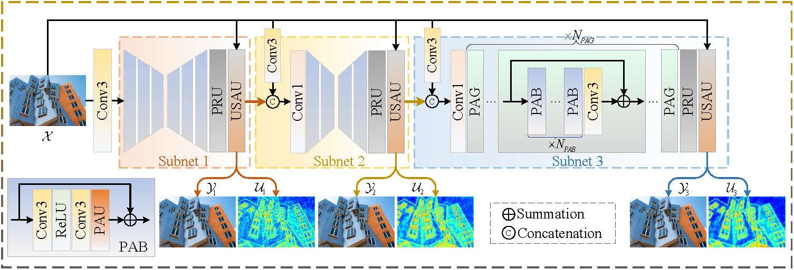
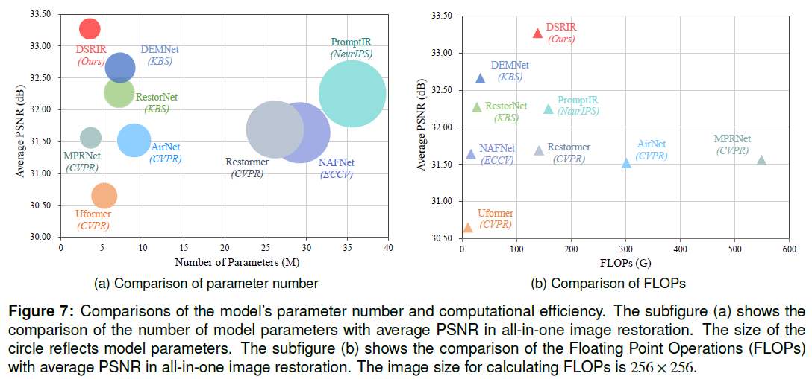
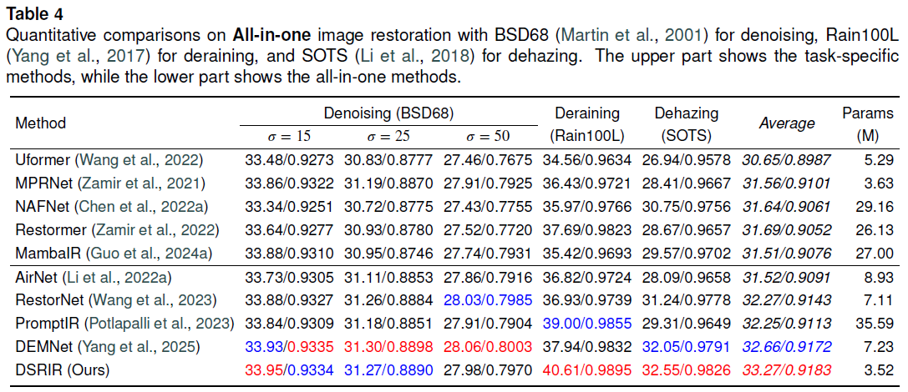
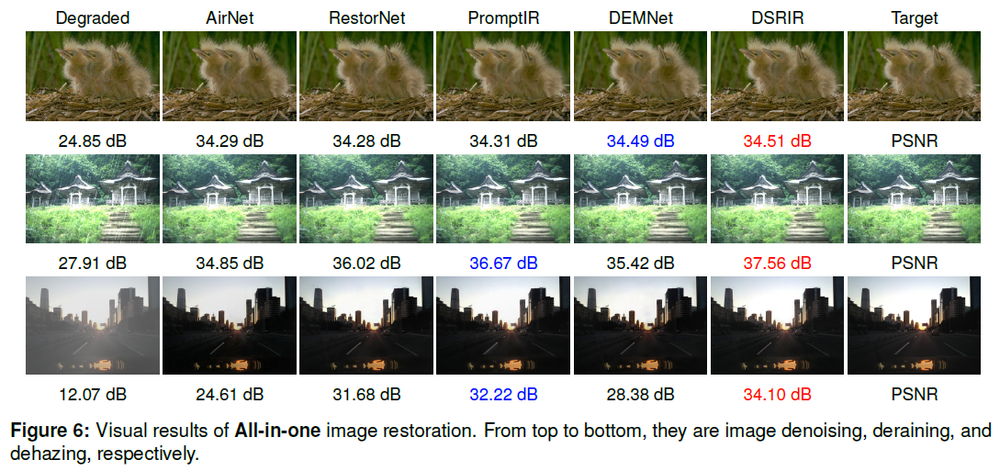
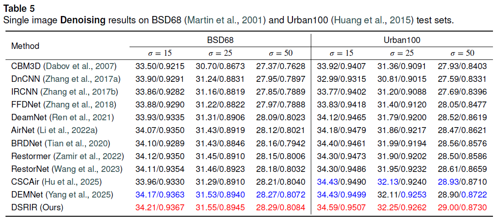
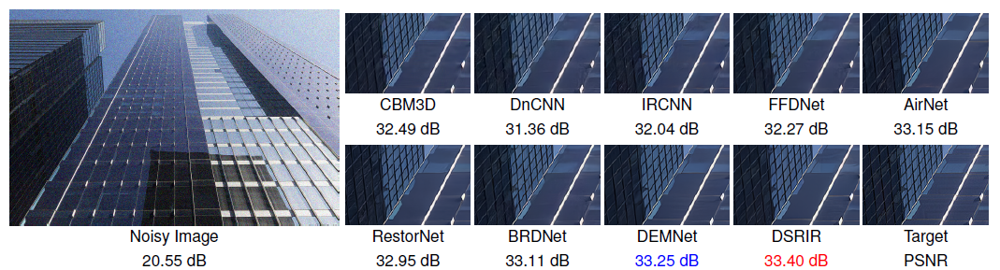
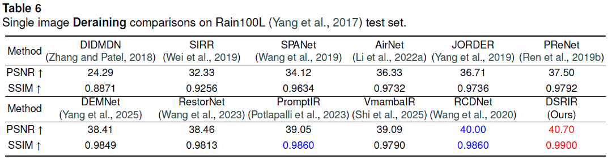
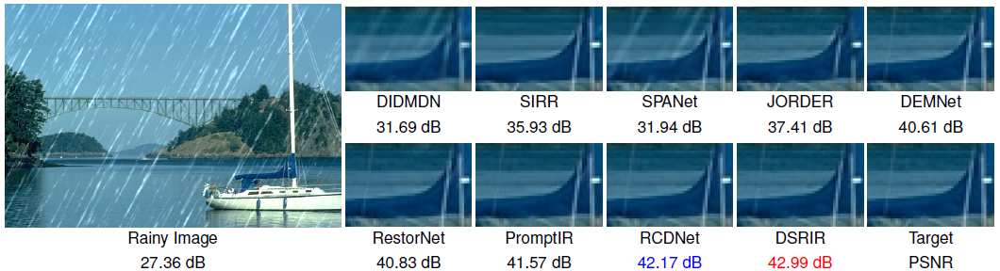
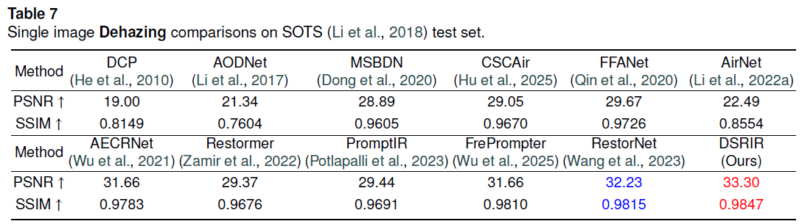
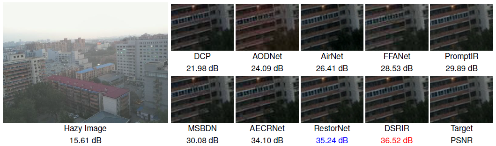

# DSRIR: Dynamic spatial refinement learning for progressive all-in-one image restoration

> [Author1], [Author2], [Author3], ...


[**[Paper]**]()

This code repository provides the official implementation of the methodology described in the paper "DSRIR: Dynamic spatial refinement learning for progressive all-in-one image restoration".

[**Abstract**]

Aiming to handle multiple types and levels of degradation(e.g., noisy, rainy, and hazy images) in a unified network, 
this paper presents a novel progressive all-in-one image restoration approach named DSRIR, 
which encompasses the following characteristics: Firstly, to better cater to the preferences of different 
degradations for network architecture and balance the model's performance across various degradations, 
we develop a progressive network that consists of three unique subnets. Secondly, we design a patch attention 
unit to dynamically model the local spatial characteristics of image content and degradation at different levels of detail, 
thereby enhancing the model's capacity to address spatial variations in image content and degradation. 
Thirdly, by introducing uncertainty learning, we develop an uncertainty supervised attention unit to capture the textural 
and edge information. After exploiting the images restored by each subnet, we establish a positive contrastive regularization to 
achieve progressive reconstruction across the whole network. Our comprehensive testing, conducted on widely used BSD68, 
Urban100, Rain100L, and SOTS across both all-in-one and single image restoration scenarios, confirms that our DSRIR surpasses 
current leading approaches such as RestorNet and PromptIR with a notably reduced parameter count. Specifically, 
DSRIR achieves the average PSNR/SSIM of 33.27 dB/0.9183 with 3.52M parameters on the all-in-one image restoration, 
while PromptIR uses 35.59M parameters to obtain the average PSNR/SSIM of 32.25 dB/0.9113.

## 💡 Pipeline




## ⭐️ Performance

We conduct extensive experiments on both all-in-one and single degradation image restoration, the experimental results are shown as follows:

<details>
  <summary> <strong>All-in-one image restoration</strong> (click to expand) </summary>
<table>
  <tr>
    <td><p align="center"> </td>
  </tr>
  <tr>
    <td><p align="center"><b>Quantatitive results of all-in-one image restoration.</b></p></td>
  </tr>
  <tr>
    <td><p align="center"> </td>
  </tr>
  <tr>
    <td><p align="center"><b>Visual results of all-in-one image restoration.</b></p></td>
  </tr>
</table></details>

<details>
  <summary> <strong>Image denoising</strong> (click to expand) </summary>
<table>
  <tr>
    <td><p align="center"> </td>
  </tr>
  <tr>
    <td><p align="center"><b>Quantatitive results of image denoising.</b></p></td>
  </tr>
  <tr>
    <td><p align="center"> </td>
  </tr>
  <tr>
    <td><p align="center"><b>Visual results of image denoising.</b></p></td>
  </tr>
</table></details>

<details>
  <summary> <strong>Image deraining</strong> (click to expand) </summary>
<table>
  <tr>
    <td><p align="center"> </td>
  </tr>
  <tr>
    <td><p align="center"><b>Quantatitive results of image deraining.</b></p></td>
  </tr>
  <tr>
    <td><p align="center"> </td>
  </tr>
  <tr>
    <td><p align="center"><b>Visual results of image deraining.</b></p></td>
  </tr>
</table></details>

<details>
  <summary> <strong>Image dehazing</strong> (click to expand) </summary>
<table>
  <tr>
    <td><p align="center"> </td>
  </tr>
  <tr>
    <td><p align="center"><b>Quantatitive results of image dehazing.</b></p></td>
  </tr>
  <tr>
    <td><p align="center"> </td>
  </tr>
  <tr>
    <td><p align="center"><b>Visual results of image dehazing.</b></p></td>
  </tr>
</table></details>


## 😀Quick Start
### ⚙️ 1. Installation

Our model is evaluated on [Anaconda](https://www.anaconda.com/) virtual environment with a [Pytorch](https://pytorch.org/) version of 1.10.0.
You should create and activate the environment to install the necessary packages and modules to run the codes.

### 💾 2. Data Preparation  
For evaluating the performance of the proposed DSRIR, we select three degradations to conduct experiments, namely noise, rain, and haze.
The dataset details for these three degradations are shown in the following:  

The training and test datasets for image denoising, deraining, and dehazing can be downloaded here [All-in-one dataset](https://pan.baidu.com/s/1TbYQHZAE2Tr7XKbCGbg0WQ?pwd=pk6q).
- <u>**[Image Denoising]**</u> The training set amalgamates images from two distinct datasets: [BSD400](https://www2.eecs.berkeley.edu/Research/Projects/CS/vision/grouping/resources.html), which comprises 400 clean images, and [WED](https://ieeexplore.ieee.org/document/7752930), consisting of 4,744 clean images. Thereby, we obtain 5,144 training images. For the creation of noisy images, we introduce Gaussian noise to the clean images over a spectrum of noise levels, spanning from 0 to 55. The evaluation is performed on the [BSD68](https://www2.eecs.berkeley.edu/Research/Projects/CS/vision/bsds/) and [Urban100](https://openaccess.thecvf.com/content_cvpr_2015/papers/Huang_Single_Image_Super-Resolution_2015_CVPR_paper.pdf) datasets, encompassing noise levels of 15, 25, and 50.
- <u>**[Image Deraining]**</u> We utilize the [Rain100L](https://ieeexplore.ieee.org/document/8099666) dataset, comprising 200 sets of clean-rainy images for training and 100 sets for testing, to perform both training and evaluation.
- <u>**[Image Dehazing]**</u> We use [RESIDE](https://sites.google.com/view/reside-dehaze-datasets/reside-standard?authuser=0) Outdoor Training Set (OTS) that consists of 313,950 outdoor hazy images for training and Synthetic Objective Testing Set (SOTS) that contains 500 hazy images for testing. Worthy of note, to equalize the number of training image for the three tasks, we randomly select 5,000 hazy images from the comprehensive training dataset. Specifically, since OTS contains 8,970 clean images, we randomly select 5,000 of them as ground truths. Then, for each ground truth, we randomly select one from its corresponding 35 hazy images as the training image. Finally, we obtain a dehazing training set that contains 5,000 clean-hazy image pairs.  
- <u>**[All-in-One]**</u>  We combine the above three training datasets to form a mixed multiple degradation dataset for training, and test denoising, deraining, and dehazing tasks with the test sets for single degradation image restoration.

As for training, the relative path for each image are writen to `.csv` files. We generate the `.csv` files by `./utils/generate_dataset.py`, and then place them to the directory `./datasets/train/`. The file naming needs to follow the `train_{mode}.csv` rule so that the program can automatically load the corresponding data according to the configuration.
The data format of `.csv` files is shown as follows:
```csv
/relative/path/to/image_target_1.png | /relative/path/to/image_degraded_1.png
/relative/path/to/image_target_2.png | /relative/path/to/image_degraded_2.png
/relative/path/to/image_target_3.png | /relative/path/to/image_degraded_3.png
...
```
After preparing the training data, you can simply run the script to train the model with different modes:
```bash
# train all_in_one
python train.py --device 0 --mode all_in_one --epochs 347 --val-epochs 5 --epoch-chg 135 238 314 347 --train-dir /home/sht/all_in_one_dataset
```
```bash
# train denoising
python train.py --device 0 --mode noise --epochs 1005 --val-epochs 10 --epoch-chg 390 689 908 1005 --train-dir /home/sht/all_in_one_dataset
```
```bash
# train deraining
python train.py --device 0 --mode rain --epochs 1054 --val-epochs 10 --epoch-chg 409 722 952 1054 --train-dir /home/sht/all_in_one_dataset
```
```bash
# train dehazing
python train.py --device 0 --mode haze --epochs 1054 --val-epochs 10 --epoch-chg 409 722 952 1054 --train-dir /home/sht/all_in_one_dataset
``` 
*Parameter interpretation for training scripts:*
```text
--mode: name for the type of training data, the program relies on this parameter to load the training CSV file and save the corresponding results. In our experiments, the {mode} can be set to 'all_in_one', 'noise', 'rain', and 'haze'.
--epochs: total training epochs, the last parameter of `--epoch-chg`
--epoch-chg: determine at which epoch the program changes the image size and batch size of the image loaded by the dataloader. It can be derived by running `./utils/get_epoch_chg.py` according to your needs.
--train-dir: path to the directory of training datasets, it will merge with the relative path of the image in the CSV file to obtain the absolute path of the image.
```

### 🗂️ 3. Download Checkpoints

Please download our pretrained checkpoints [here](https://pan.baidu.com/s/1jPAhavoDLYTKxUsTeCXX9A?pwd=2knu) and put them under `./experiments`. The file directory should be:

```text
|-- experiments
|--|-- {mode}
|--|--|-- models
|--|--|--|-- DSRIR
|--|--|--|--|-- model_best.pth
...
|--|-- {mode}
|--|--|-- models
|--|--|--|-- DSRIR
|--|--|--|--|-- model_best.pth

# mode can be set to all_in_one, noise, rain, and haze.
```

### 📊 4. Test & Evaluation

You can test DSRIR with following commands:

- **Evaluation for all_in_one**
```bash
python test.py --mode all_in_one --device 0 --denoise_path /home/sht/all_in_one_dataset/BSD68/  --derain_path /home/sht/all_in_one_dataset/Rain100L/test/  --dehaze_path /home/sht/all_in_one_dataset/RESIDE_beta/SOTS/outdoor/
```
- **Evaluation for denoising**
```bash
python test.py --mode noise --device 0 --denoise_path /home/sht/all_in_one_dataset/BSD68/
```
- **Evaluation for deraining**
```bash
python test.py --mode rain --device 0 --derain_path /home/sht/all_in_one_dataset/Rain100L/test/
```
- **Evaluation for dehazing**
```bash
python test.py --mode haze --device 0 --dehaze_path /home/sht/all_in_one_dataset/RESIDE_beta/SOTS/outdoor/
```

### ☀️ 5. Restoration Results

We also provide the restoration results of both all-in-one and single degradation image restoration. If they are useful to you, you can download them [here](https://pan.baidu.com/s/1a-uSY-SyVNBk_oY1RWEecg?pwd=7net).


## 🫰 Acknowledgments

We extend our sincere gratitude to the authors of [MPRNet](https://github.com/swz30/MPRNet) for their well-structured and documented code implementation.
## 🔖 Citation
Please cite us if our work is useful for your research.

```
---
```